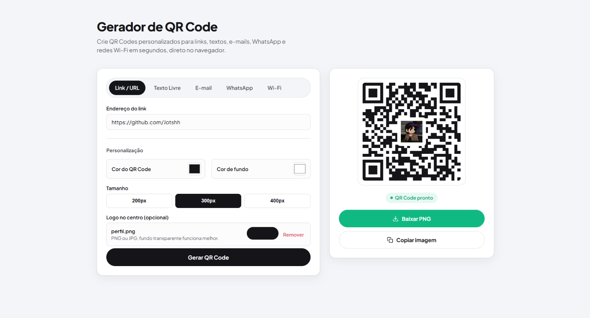

# Gerador de QRCode




Projeto simples e prático para gerar códigos QR a partir de textos, links ou informações digitadas pelo usuário. A aplicação foi desenvolvida para facilitar o uso e permitir a criação rápida de QR Codes diretamente no navegador.

---

## Deploy 

https://gerador-de-qrcode-lac.vercel.app/

---

## Tecnologias Utilizadas

* HTML5
* CSS3
* JavaScript
* Biblioteca de geração de QR Code

---

## Funcionalidades

- Gerar QR Code a partir de qualquer texto ou URL
- Exibir o código gerado em tempo real na interface
- Baixar a imagem do QR Code gerado
- Interface simples e responsiva para uso rápido

---

## Como Executar o Projeto

### Pré-requisitos

Certifique-se de ter um navegador moderno instalado em sua máquina.

### Passos

1. Clone o repositório:
   ```bash
   git clone https://github.com/seu-usuario/qrcode.git
   cd qrcode
   ```

2. Abra o arquivo `index.html` no navegador.

3. Digite o texto ou URL desejado no campo de entrada.

4. O QR Code será gerado automaticamente.

5. Se quiser, baixe a imagem gerada para uso posterior.

---

## Como Usar

1. Acesse a página inicial do projeto.
2. Informe o texto, link ou conteúdo que deseja transformar em QR Code.
3. O sistema gera automaticamente o código em formato visual.
4. Utilize a opção de download para salvar a imagem.

---

## Licença

Este projeto está licenciado sob a MIT License.

---

## Suporte

Email: josiephelipel265@gmail.com

---
